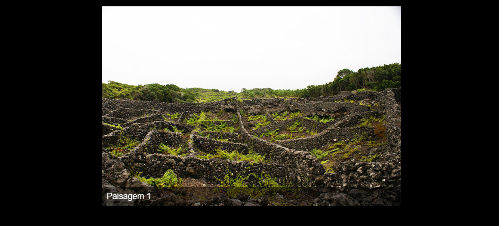
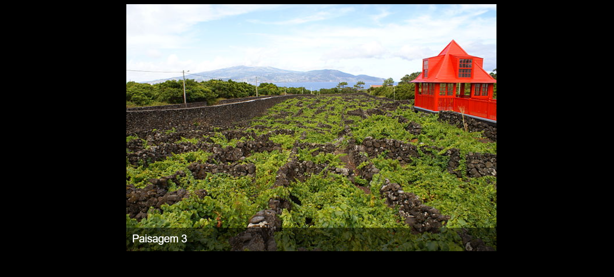

# CAROUSEL EM JQUERY
👨‍🏫PROJETO CRIADO PARA O CURSO DE JQUERY.

  
  
  

## DESCRIÇÃO:
O projeto "Carousel em jQuery" é uma implementação simples de um carrossel de imagens com a biblioteca jQuery. Este projeto demonstra como criar uma apresentação de slides automática com transições suaves entre imagens e a exibição de legendas dinâmicas baseadas no atributo `alt` de cada imagem.

## FUNCIONALIDADES:
- **Carrossel de Imagens**: Exibe uma série de imagens de maneira sequencial, com uma transição suave de fade entre cada imagem.
- **Legendas Dinâmicas**: Exibe uma legenda para cada imagem, utilizando o atributo `alt` das imagens para o texto das legendas, que são atualizadas automaticamente conforme as imagens mudam.

## NÃO SABE?
- Entendemos que para manipular arquivos em `HTML`, `CSS` e outras linguagens relacionadas, é necessário possuir conhecimento nessas áreas. Para auxiliar nesse aprendizado, oferecemos cursos gratuitos disponíveis:
* [CURSO DE HTML E CSS](https://github.com/VILHALVA/CURSO-DE-HTML-E-CSS)
* [CURSO DE JAVASCRIPT](https://github.com/VILHALVA/CURSO-DE-JAVASCRIPT)
* [CONFIRA MAIS CURSOS](https://github.com/VILHALVA?tab=repositories&q=+topic:CURSO)

## CREDITOS:
- [PROJETO CRIADO PARA O CURSO DE JQUERY](https://github.com/VILHALVA/CURSO-DE-JQUERY)
- [PROJETO FEITO PELO VILHALVA](https://github.com/VILHALVA)